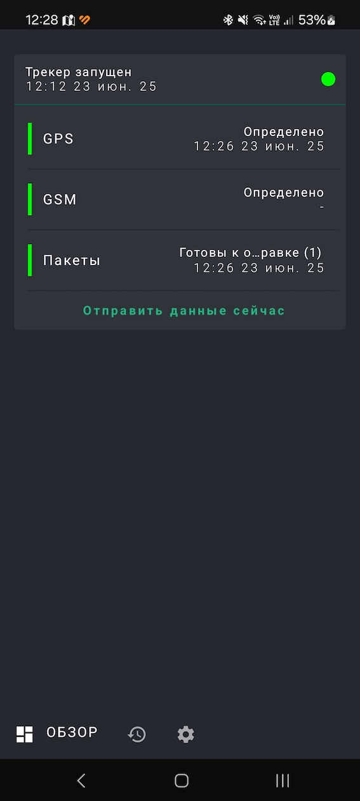
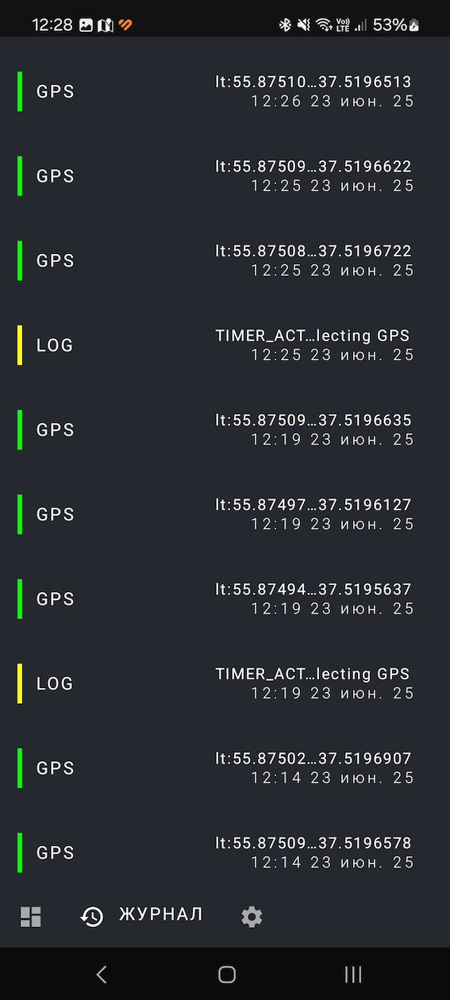
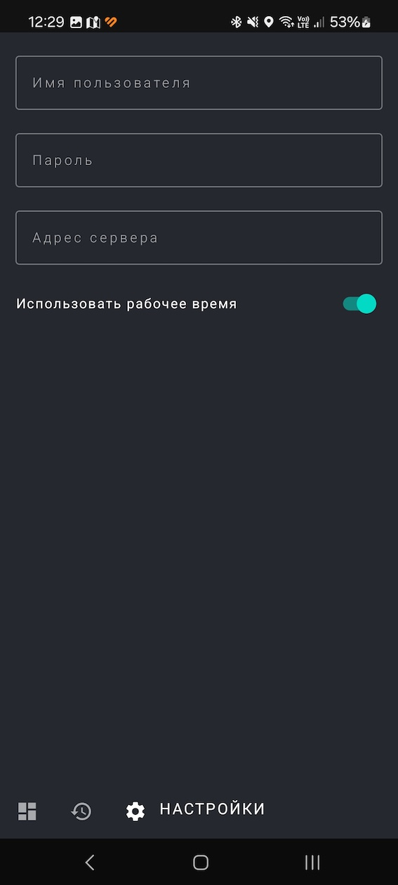

# Open Tracker Android sample app

This sample showcase architectural approach to developing Android app that track user location in background and foreground cases.

In this app you'll find:
*   User Interface built with **[Jetpack Compose](https://developer.android.com/jetpack/compose)** 
*   A single-activity architecture, using **[Navigation Compose](https://developer.android.com/jetpack/compose/navigation)**.
*   A presentation layer that contains a Compose screen (View) and a **ViewModel** per screen (or feature).
*   Reactive UIs using **[Flow](https://developer.android.com/kotlin/flow)** and **[coroutines](https://kotlinlang.org/docs/coroutines-overview.html)** for asynchronous operations.
*   A data laer using **[Foreground](https://developer.android.com/develop/background-work/services/fgs)** with fused location provider **[Get the last known location](https://developer.android.com/develop/sensors-and-location/location/retrieve-current)** .

## Screenshots

## What is it not?

*   A UI/Material Design sample. The interface of the app is deliberately kept simple to focus on architecture.
*   A real production app with network access, user authentication, etc.

## Who is it for?

*   Intermediate developers and beginners looking for a sample app with location feache.
*   Advanced developers looking for ready to use solution for business.
